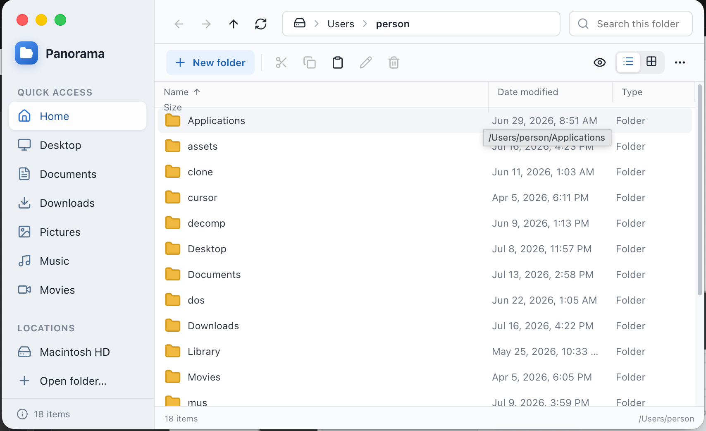

# Panorama

A respectable file explorer — Windows Explorer–inspired browsing for the desktop.



## Run

```bash
npm run dev
# or: cd flutter_app && flutter run -d macos
# Linux: cd flutter_app && flutter run -d linux
```

## Build

```bash
cd flutter_app
flutter build macos
# → flutter_app/build/macos/Build/Products/Release/Panorama.app

flutter build linux --release
../scripts/package-deb.sh 1.0.6
# → release/Panorama-1.0.6-linux-amd64.deb
```

Tagged releases publish a macOS `.zip` and a Linux `.deb` via GitHub Actions.

## Spotlight launcher (macOS)

Install a `/Applications/Panorama.app` stub that opens the local Flutter build (so notes stay in this repo for Cursor):

```bash
./scripts/install-mac.sh
```

Notes are stored at `notes/improvements.json` (same path the Cursor improvement-notes skill expects).

## Features

- Dual-pane browsing, list/grid views, Quick Access locations
- Cut / copy / paste, rename, new folder, trash
- Open, Open with… (macOS), Reveal in file manager
- Drag-and-drop import
- Notes panel backed by `notes/improvements.json`
